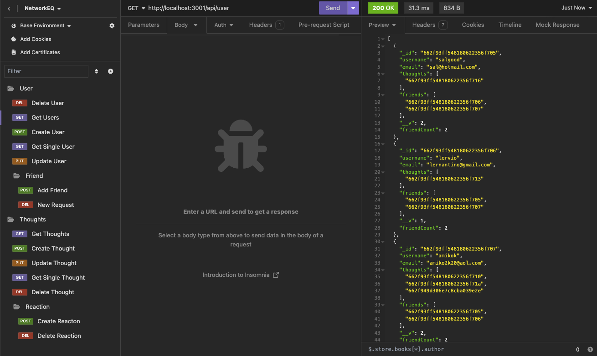

# NetworkEQ

## Description

Network EQ is a social media API that supports users, thoughts (posts that have text and can be reacted to) and reactions which are responses to thoughts. It supports all CRUD commands for each data types.

Demo Video:https://youtu.be/7sw1SeKcOqg)

## Table of Contents 

- [Installation](#installation)
- [Usage](#usage)
- [Credits](#credits)
- [License](#license)

## Installation
Simple clone this repo to your desktop, run npm i and then npm start. This is setup to run at your localhost.

How do I install Dependencies?
npm i

## Usage

Use this app as a backend for a social media platform that works with these 3 data objects: Users, Thoughts and Reactions.

## Credits

## License 

This project is licensed under the MIT License.

Find more about this license here: https://opensource.org/licenses/MIT.

        

## Tests

How do I run tests?
No tests

## Questions

Please direct your questions towards Ben at:
Github: zaczacariah
Email: ben-zac@outlook.com

    